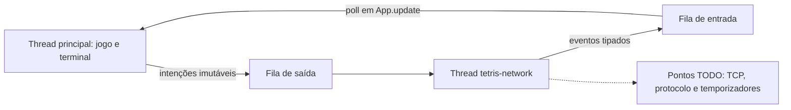

# Esquema de threads para implementar a comunicação

Atualização: 07/10/2026. Protocolo TVP/1 e controlador da partida única
do servidor estão implementados.
O código atual não conecta sockets nem envia bytes pela rede
e não executa KEEPALIVE ou timeout de rede. Esses pontos levantam
`NotImplementedError` com o marcador `TODO[EP-REDE]`.

## O que está pronto

A thread principal executa teclado, `App.update()`, física do `Engine` e desenho
com curses. A futura thread `tetris-network` possui filas protegidas por
`threading.Lock`, um `threading.Event` para parada e um laço de processamento.
O jogo não compartilha seu tabuleiro mutável com a thread de rede.



`_start_worker(nickname)` agenda `HelloOffered(nickname)` primeiro e inicia a
thread. `_enqueue(command)` entrega intenções ao laço sem fazer serialização.
As intenções reutilizam os tipos de `session.py`: `HelloOffered`, `ReadyOffered`,
`BoardOffered`, `AttackOffered` e `DefeatOffered`. Esse catálogo interno não
adiciona tipos ao protocolo TVP/1.

O laço envia até 32 intenções por ciclo, consulta eventos e chama o ponto de
processamento dos temporizadores. Espera até 20 ms entre ciclos com uma espera
interrompível. A ordem FIFO conserva ataque → tabuleiro → derrota. As filas
contêm até 256 itens; excesso produz falha visível, sem descartar ataques
silenciosamente. Esse limite de objetos não substitui o futuro limite de
4096 bytes no buffer de transporte.

`_publish(event)` coloca eventos recebidos na fila de entrada. `poll()` apenas
drena essa fila, sem realizar I/O. `App.update()` aplica os eventos na thread
principal, mantendo toda a física e todas as chamadas curses nesse fluxo.

## Onde implementar no cliente

Arquivo: `src/tetris_client/network.py`.

| Método pendente | Implementação esperada |
| --- | --- |
| `start(nickname)` | Habilitar a sessão quando os pontos abaixo estiverem implementados, chamando `_start_worker(nickname)`. |
| `ready()` | Validar a fase e chamar `_enqueue(ReadyOffered())`. |
| `offer_board(board)` | Validar a fase e chamar `_enqueue(BoardOffered(board))`. |
| `attack(amount)` | Validar a fase e a quantidade 1, 2 ou 4; chamar `_enqueue(AttackOffered(amount))`. |
| `defeat(reason)` | Agendar `DefeatOffered(reason)` uma vez; manter conexão até resultado. |
| `_connect()` | Criar e conectar o socket TCP usando `self.host` e `self.port`, limitando o tempo de conexão. |
| `_send(command)` | Traduzir a intenção, serializar e manter o buffer de envio, inclusive escritas parciais e limite de 4096 bytes. |
| `_receive_events()` | Ler sem bloquear, detectar EOF, delimitar/interpretar bytes, validar direção/fase e devolver eventos tipados. |
| `_process_timers()` | Implementar KEEPALIVE a cada 5 s após HELLO e timeout de 15 s, com `self._clock`. |
| `_close_connection()` | Liberar socket e buffers na thread de rede, inclusive se a conexão falhou. |

Os cinco últimos métodos são chamados exclusivamente pelo laço da thread.
`_send` recebe HELLO como primeira intenção depois que `_connect` retorna.
Os métodos públicos de intenção continuam stubs para que sua implementação
inclua as regras de estado do protocolo, sem aparentar comunicação funcional.
O `start` atual não chama `_start_worker`; portanto, o modo network ainda não
inicia a thread nem uma conexão. Os testes ativam o auxiliar em uma subclasse
que substitui os pontos pendentes, exclusivamente para verificar concorrência.

`close()` já sinaliza parada e aguarda a thread por até 200 ms. O laço chama
`_close_connection()` em `finally`, fora do bloqueio das filas. Implemente os
pontos de transporte com espera limitada e verificação de parada; uma operação
bloqueada pode sobreviver ao prazo de `close()`. A thread é daemon. Ela não
processa comandos nem publica eventos após observar a parada. Fechamento
repetido é seguro e a sessão não pode ser reutilizada.

## Protocolo compartilhado implementado

Arquivo: `src/tetris_shared/protocol.py`.

- `encode(tipo_mensagem, campos)`: recebe `MessageType` e tupla de strings;
  valida e produz uma linha ASCII TVP/1 com LF.
- `parse(linha)`: recebe bytes de exatamente uma linha incluindo LF;
  valida prefixo, tipo e campos, devolvendo `MessageType` e tupla de strings.
- `Framer.feed(dados)`: recebe bytes, retorna linhas completas com LF e
  conserva o fragmento. Use uma instância por conexão. O limite é 512 bytes
  incluindo LF: fragmento de 511 bytes pode ser completado; 512 sem LF é erro.

Tipos Python incorretos geram `TypeError`; conteúdo inválido gera `ValueError`.
Após excesso, o delimitador libera o fragmento e permanece inválido. O adaptador
deve encerrar a conexão. Se um lote contém excesso, a chamada lança a exceção
sem entregar as linhas daquele lote. Delimitação não valida sintaxe: cada
linha retornada deve passar por `parse`. Entrada vazia não indica EOF ao
Framer; detectar EOF pertence ao transporte.

Direção, fase e combinações semânticas de resultado/motivo continuam nos
adaptadores. O codec valida os tokens da gramática. Buffers de saída de
4096 bytes, escritas parciais e timers também pertencem ao transporte.

Exatamente oito tipos: HELLO, MATCH, READY, BOARD, ATTACK, KO, GAMEOVER e
KEEPALIVE. BOARD contém 200 dígitos de blocos fixos. A especificação de gramática,
direções, fases e resultados continua em [00-contexto-geral.md](00-contexto-geral.md).
Não importar socket, protocolo ou curses no motor.

## Interface e servidor

`--host` e `--port` guardam o destino futuro, com padrão `127.0.0.1:8765`.
Multiplayer informa pendência e retorna ao menu. `--mode network` em terminal
interativo termina com código 2 e o TODO; nunca cai em `FakeSession`.
Treino e simulação permanecem funcionais.

O pacote `src/tetris_server/` fornece `ControladorPartida` em `partida.py`.
Ele admite duas conexões, exige HELLO, informa MATCH, espera ambos PLAYER,
produz GO, encaminha BOARD/ATTACK e grava um único resultado antes de devolver
as notificações GAMEOVER. Ainda não há executável servidor nem TCP.

## API do controlador da partida

Todas as chamadas retornam `list[AcaoServidor]`, na ordem a executar. São ações
Python internas, não mensagens extras no TVP/1:

| Método | Responsabilidade |
| --- | --- |
| `admitir(conexao)` | Reservar uma das duas posições; rejeitar terceira ou nova conexão após encerramento com FecharConexao. |
| `receber(conexao, tipo_mensagem, campos)` | Validar sintaxe, direção e fase; retornar envios ao oponente ou decisão final. |
| `desconectar(conexao)` | Informar perda da conexão, aplicando DISCONNECT. |
| `falhar(conexao, motivo)` | Informar DISCONNECT, TIMEOUT ou PROTOCOL observado pelo adaptador. |
| `parar()` | Cancelar por SERVER_STOP, inclusive antes de identificar ambos. |

A referência de conexão é um objeto hashable estável, distinto por conexão;
não trafega no protocolo nem constitui ID de jogador/partida. Não reutilizar
referências encerradas. O futuro loop chama o controlador sequencialmente:
a classe não faz sincronização entre threads.

`EnviarMensagem(conexao, tipo_mensagem, campos)` solicita envio futuro;
`FecharConexao(conexao)` solicita fechamento imediato. Os objetos são imutáveis.
`fase` informa AGUARDANDO, PREPARACAO, ATIVA ou ENCERRADA; `decisao` contém
motivo e resultados imutáveis por participante identificado.

Uma falha antes de HELLO libera a posição. Depois de HELLO, encerra a partida:
CANCEL antes de GO, WIN ao oponente durante o jogo, com o resultado do ausente
registrado internamente. O participante indisponível não recebe intenção de
GAMEOVER. KO válido produz LOSE/WIN; a parada planejada sempre produz CANCEL.
Após decisão, mensagens/falhas tardias não mudam o resultado. READY/PLAYER
repetido ou atrasado é idempotente, e KEEPALIVE não produz resposta.

O adaptador deverá processar parse/framing e comunicar erros com PROTOCOL;
acompanhar os prazos de HELLO (5 s), KEEPALIVE (5 s) e inatividade (15 s);
serializar as ações na ordem; tratar buffers/escritas parciais; e, ao verificar
ENCERRADA, tentar escoar GAMEOVER por até 1 s antes de fechar tudo e terminar.
Não fechar os destinatários de GAMEOVER antes dessa tentativa de envio.
Esses mecanismos continuam pendentes. Uma nova partida exigirá reiniciar
servidor e clientes.

## Testes da estrutura

```bash
.venv/bin/python -m unittest discover -s tests
# Sem instalação:
PYTHONPATH=src python3 -m unittest discover -s tests
```

`tests/test_network.py` usa uma subclasse exclusiva de teste para verificar
ordem das intenções, thread responsável pelas chamadas, filas, erros e parada,
sem sockets. Também verifica que espera de conexão/envio não bloqueia o jogo
ou `poll()`. `tests/test_protocol.py` cobre validação, codec e framing sem
sockets, incluindo fragmentação e limites. Testes de TCP, escritas parciais
e temporizadores continuam pendentes. `tests/test_server.py` valida os estados
e resultados com referências em memória, sem sockets.
