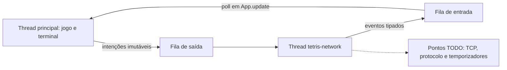

# Esquema de threads para implementar a comunicação

Atualização: 05/10/2026. A comunicação real fica para implementação pela equipe.
O código atual não conecta sockets, não envia bytes, não interpreta mensagens
e não executa KEEPALIVE ou timeout de rede. Esses pontos levantam
`NotImplementedError` com o marcador `TODO[EP-REDE]`.

## O que está pronto

A thread principal executa teclado, `App.update()`, física do `Engine` e desenho
com curses. A futura thread `tetris-network` possui filas protegidas por
`threading.Lock`, um `threading.Event` para parada e um laço de processamento.
O jogo não compartilha seu tabuleiro mutável com a thread de rede.



`_start_worker(nickname)` agenda `HelloOffered(nickname)` primeiro e inicia a
thread. `_enqueue(command)` entrega intenções ao laço sem fazer serialização.
As intenções reutilizam os tipos de `session.py`: `HelloOffered`, `ReadyOffered`,
`BoardOffered`, `AttackOffered` e `DefeatOffered`. Esse catálogo interno não
adiciona tipos ao protocolo TVP/1.

O laço envia até 32 intenções por ciclo, consulta eventos e chama o ponto de
processamento dos temporizadores. Espera até 20 ms entre ciclos com uma espera
interrompível. A ordem FIFO conserva ataque → tabuleiro → derrota. As filas
contêm até 256 itens; excesso produz falha visível, sem descartar ataques
silenciosamente. Esse limite de objetos não substitui o futuro limite de
4096 bytes no buffer de transporte.

`_publish(event)` coloca eventos recebidos na fila de entrada. `poll()` apenas
drena essa fila, sem realizar I/O. `App.update()` aplica os eventos na thread
principal, mantendo toda a física e todas as chamadas curses nesse fluxo.

## Onde implementar no cliente

Arquivo: `src/tetris_client/network.py`.

| Método pendente | Implementação esperada |
| --- | --- |
| `start(nickname)` | Habilitar a sessão quando os pontos abaixo estiverem implementados, chamando `_start_worker(nickname)`. |
| `ready()` | Validar a fase e chamar `_enqueue(ReadyOffered())`. |
| `offer_board(board)` | Validar a fase e chamar `_enqueue(BoardOffered(board))`. |
| `attack(amount)` | Validar a fase e a quantidade 1, 2 ou 4; chamar `_enqueue(AttackOffered(amount))`. |
| `defeat(reason)` | Agendar `DefeatOffered(reason)` uma vez; manter conexão até resultado. |
| `_connect()` | Criar e conectar o socket TCP usando `self.host` e `self.port`, limitando o tempo de conexão. |
| `_send(command)` | Traduzir a intenção, serializar e manter o buffer de envio, inclusive escritas parciais e limite de 4096 bytes. |
| `_receive_events()` | Ler sem bloquear, detectar EOF, delimitar/interpretar bytes, validar direção/fase e devolver eventos tipados. |
| `_process_timers()` | Implementar KEEPALIVE a cada 5 s após HELLO e timeout de 15 s, com `self._clock`. |
| `_close_connection()` | Liberar socket e buffers na thread de rede, inclusive se a conexão falhou. |

Os cinco últimos métodos são chamados exclusivamente pelo laço da thread.
`_send` recebe HELLO como primeira intenção depois que `_connect` retorna.
Os métodos públicos de intenção continuam stubs para que sua implementação
inclua as regras de estado do protocolo, sem aparentar comunicação funcional.
O `start` atual não chama `_start_worker`; portanto, o modo network ainda não
inicia a thread nem uma conexão. Os testes ativam o auxiliar em uma subclasse
que substitui os pontos pendentes, exclusivamente para verificar concorrência.

`close()` já sinaliza parada e aguarda a thread por até 200 ms. O laço chama
`_close_connection()` em `finally`, fora do bloqueio das filas. Implemente os
pontos de transporte com espera limitada e verificação de parada; uma operação
bloqueada pode sobreviver ao prazo de `close()`. A thread é daemon. Ela não
processa comandos nem publica eventos após observar a parada. Fechamento
repetido é seguro e a sessão não pode ser reutilizada.

## Onde implementar o protocolo

Arquivo: `src/tetris_shared/protocol.py`.

- `encode(message_type, fields)`: validar e produzir uma linha ASCII TVP/1 com LF.
- `parse(line)`: validar prefixo, tipo e campos, devolvendo o par tipo/campos.
- `Framer.feed(data)`: acumular fragmentos TCP e separar todas as linhas completas,
  limitando cada linha a 512 bytes incluindo LF.

Exatamente oito tipos: HELLO, MATCH, READY, BOARD, ATTACK, KO, GAMEOVER e
KEEPALIVE. BOARD contém 200 dígitos de blocos fixos. A especificação de gramática,
direções, fases e resultados continua em [00-contexto-geral.md](00-contexto-geral.md).
Não importar socket, protocolo ou curses no motor.

## Interface e servidor

`--host` e `--port` guardam o destino futuro, com padrão `127.0.0.1:8765`.
Multiplayer informa pendência e retorna ao menu. `--mode network` em terminal
interativo termina com código 2 e o TODO; nunca cai em `FakeSession`.
Treino e simulação permanecem funcionais.

O servidor `src/tetris_server/` também precisa ser criado. Ele deverá aceitar
dois jogadores, validar HELLO, enviar MATCH, esperar READY/PLAYER de ambos,
autorizar READY/GO, encaminhar boards/ataques e confirmar um único resultado.
Uma nova partida exigirá reiniciar servidor e clientes.

## Testes da estrutura

```bash
.venv/bin/python -m unittest discover -s tests
# Sem instalação:
PYTHONPATH=src python3 -m unittest discover -s tests
```

`tests/test_network.py` usa uma subclasse exclusiva de teste para verificar
ordem das intenções, thread responsável pelas chamadas, filas, erros e parada,
sem sockets. Também verifica que espera de conexão/envio não bloqueia o jogo
ou `poll()`. O teste de protocolo confirma que os três pontos continuam stubs.
Esses testes validam o esquema concorrente; os testes de TCP, codec, framing,
escritas parciais e temporizadores serão necessários quando você implementar
os pontos pendentes.
